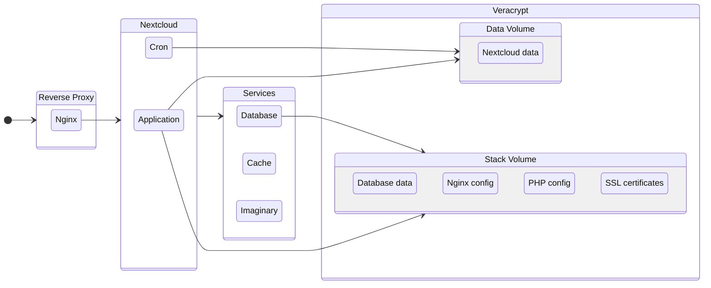

# Nextcloud with Veracrypt

This project automates the deployment of Nextcloud using Docker, with [NGINX](https://nginx.org/en/) as a reverse proxy configured to support [HTTP/3](https://en.wikipedia.org/wiki/HTTP/3) and [Google Brotli](https://github.com/google/brotli) compression for optimized performance. It ensures data security by storing all user data within [Veracrypt](https://www.veracrypt.fr/en/Home.html) volumes, providing encrypted storage for sensitive files. This project aims to offer a robust self-hosted Nextcloud instance with enhanced security, speed, and encryption features.

## The WHY of the project

I envisioned a system that allowed me to interact with my files in a timeline-like view, create albums, and through traditional file and folder navigation at multiple platforms, including Windows and Linux. Most importantly, I wanted to ensure that all of my data was encrypted.

Veracrypt became a key part of this solution. It allowed me to create encrypted containers that could be mounted as virtual drives, enabling me to browse and manage my files just like any regular filesystem on both Windows and Linux. This gave me the security of encryption without sacrificing the ease of access and flexibility I needed to organize and view my files across different operating systems.

Nextcloud played an equally important role by providing me with the same tools that cloud storage services offer, but in a self-hosted, private environment. It allowed me to seamlessly access, share, and sync my files across multiple devices, while also giving me the ability to create albums and manage my data just as I would on a typical cloud service. With Nextcloud, I was able to replicate the benefits of cloud storage without compromising my privacy or being bound by subscription fees.

## Containers and Volumes structure

The project uses two Veracrypt volumes as the Nextcloud needs to be mounted in a filesystem with restrictive permissions.

## Docker images

This project uses:

- [Nginx](https://hub.docker.com/r/macbre/nginx-http3) with a custom compiled version to support HTTP/3 and Brotli
- [Nexcloud](https://hub.docker.com/_/nextcloud) with a custom extended version to include ffmpeg, zip, and others
- [MariaDB](https://hub.docker.com/_/mariadb) as database
- [Redis](https://hub.docker.com/_/redis) as cache
- [Imaginary](https://github.com/h2non/imaginary) to process images

## Documentation

- [How to deploy](docs/how-to-deploy.md)
- [How to automatically mount Veracrypt volumes at boot](docs/open-volumes-boot.md)
