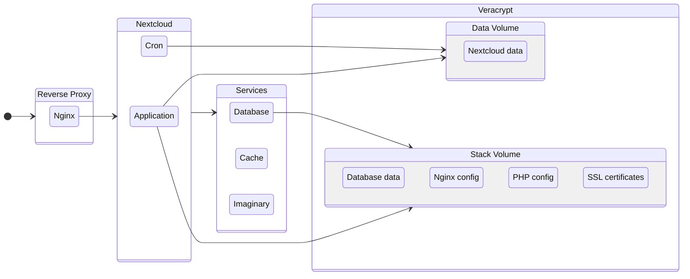

# Nextcloud with Veracrypt

This project automates the deployment of Nextcloud using Docker, with [NGINX](https://nginx.org/en/) as a reverse proxy configured to support [HTTP/3](https://en.wikipedia.org/wiki/HTTP/3) and [Google Brotli](https://github.com/google/brotli) compression. It ensures data security by storing all data within [Veracrypt](https://www.veracrypt.fr/en/Home.html) volumes.

The project uses two Veracrypt volumes as the Nextcloud needs to be mounted in a filesystem with restrictive permissions.

## The WHY of the project

This project began with a simple need: I wanted to browse and organize my photos locally using folders. I needed the ability to securely store the files on an external drive with encryption, but I needed to access it across both Windows and Linux. Beyond storage, I also wanted features like a timeline view, map view, album organization, and automatic backup from my phone.

Veracrypt allowed me to create encrypted containers that could be mounted as virtual drives to browse and manage my files. This gave me the security of encryption without sacrificing the ease of access and flexibility I needed.

Nextcloud provide the same tools that cloud storage services offer, but in a self-hosted, private environment. It allowed me to seamlessly access, share, and sync my files across multiple devices, while also giving me the ability to create albums and manage my data just as I would on a typical cloud service.

## Documentation

- [How to deploy](docs/how-to-deploy.md)
