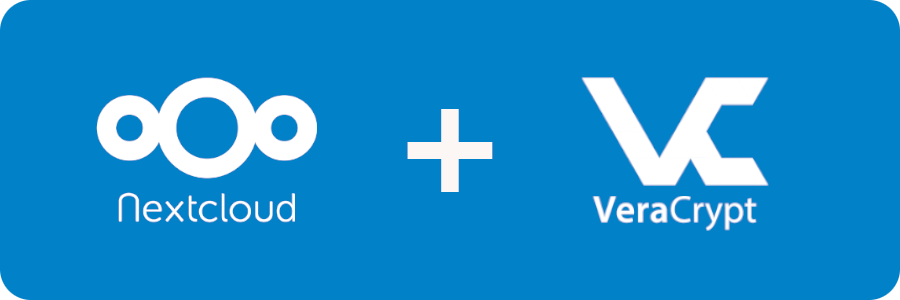
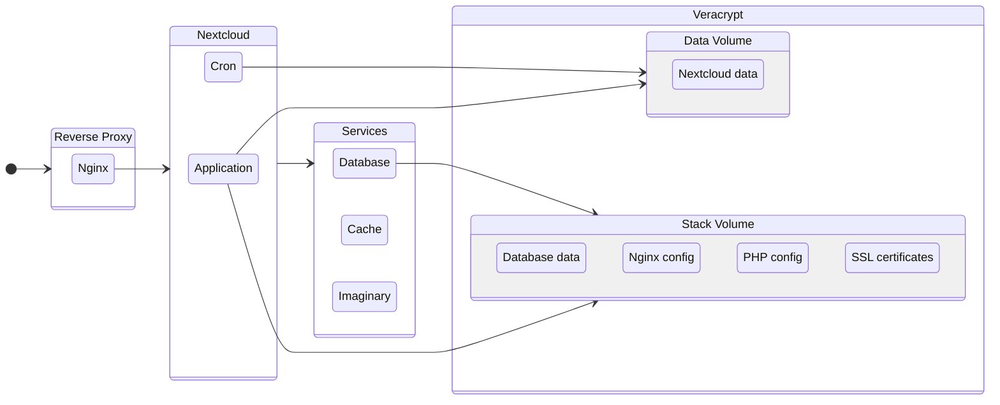

# Nextcloud with Veracrypt

This project automates the deployment of Nextcloud using Docker, with [NGINX](https://nginx.org/en/) as a reverse proxy configured to support [HTTP/3](https://en.wikipedia.org/wiki/HTTP/3) and [Google Brotli](https://github.com/google/brotli) compression. It ensures data security by storing all data within [Veracrypt](https://www.veracrypt.fr/en/Home.html) volumes.

## The WHY of the project

This project began with a simple need: I wanted an efficient way to browse and organize my photos locally within a familiar file and folder structure. Additionally, I needed the ability to securely store my photos on an external drive with encryption, ensuring seamless access across both Windows and Linux platforms. Beyond basic storage, I also wanted to enhance my photo management experience. I envisioned features like a timeline view, a map for geotagged images, album organization, and, importantly, automatic backup from my phone—all while maintaining a user-friendly, cross-platform solution.

Veracrypt became a key part of this solution. It allowed me to create encrypted containers that could be mounted as virtual drives, enabling me to browse and manage my files just like any regular filesystem on both Windows and Linux. This gave me the security of encryption without sacrificing the ease of access and flexibility I needed.

Nextcloud played an equally important role by providing me with the same tools that cloud storage services offer, but in a self-hosted, private environment. It allowed me to seamlessly access, share, and sync my files across multiple devices, while also giving me the ability to create albums and manage my data just as I would on a typical cloud service.

## Containers and Volumes structure

The project uses two Veracrypt volumes as the Nextcloud needs to be mounted in a filesystem with restrictive permissions.

## Docker images

This project uses:

- [Nginx](https://hub.docker.com/r/macbre/nginx-http3) with a custom compiled version to support HTTP/3 and Brotli
- [Nexcloud](https://hub.docker.com/_/nextcloud) with a custom extended version to include ffmpeg, zip, and others
- [MariaDB](https://hub.docker.com/_/mariadb) as database
- [Redis](https://hub.docker.com/_/redis) as cache
- [Imaginary](https://github.com/h2non/imaginary) to process images

## Documentation

- [How to deploy](docs/how-to-deploy.md)
