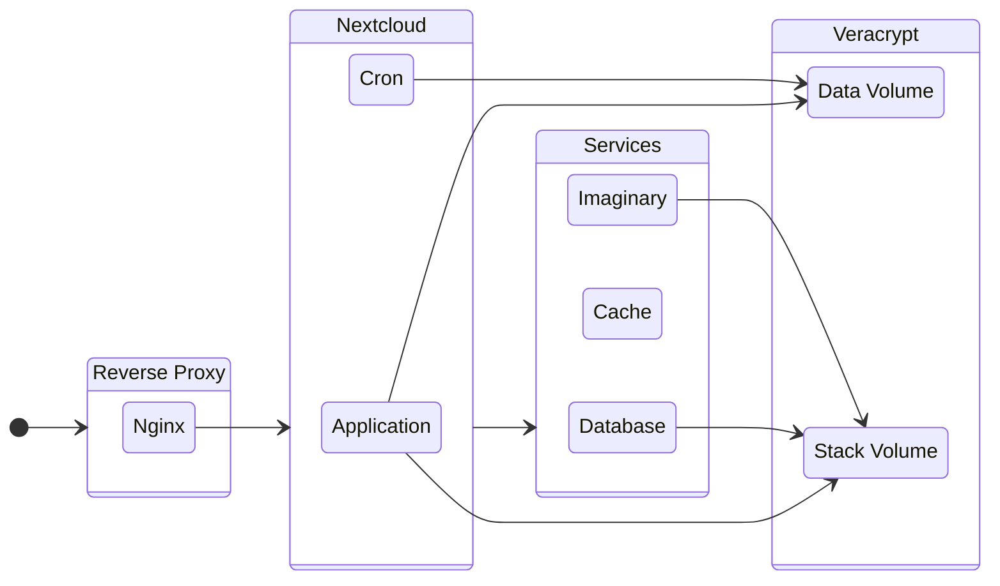

# Nextcloud with Veracrypt

This project automates the deployment of Nextcloud using Docker, with [NGINX](https://nginx.org/en/) as a reverse proxy configured to support [HTTP/3](https://en.wikipedia.org/wiki/HTTP/3) and [Google Brotli](https://github.com/google/brotli) compression for optimized performance. It ensures data security by storing all user data within [Veracrypt](https://www.veracrypt.fr/en/Home.html) volumes, providing encrypted storage for sensitive files. This project aims to offer a robust self-hosted Nextcloud instance with enhanced security, speed, and encryption features.

## Structure

## Docker images

This project uses:

- [MariaDB](https://hub.docker.com/_/mariadb) as database
- [Redis](https://hub.docker.com/_/redis) as cache
- [Imaginary](https://github.com/h2non/imaginary) to process images
- [Nginx](https://hub.docker.com/r/macbre/nginx-http3) with a custom compiled version to support HTTP/3 and Brotli
- [Nexcloud](https://hub.docker.com/_/nextcloud) with a custom extended version to include ffmpeg, zip, and others

## Documentation

- [How to manually mount Veracrypt volumes](docs/mounting-volumes.md)
- [How to automatically mount Veracrypt volumes at boot](docs/open-volumes-boot.md)
- [How to deploy](docs/how-to-deploy.md)
