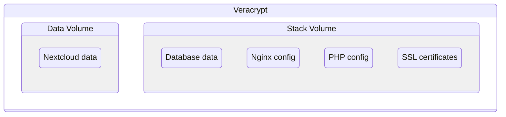

# Setup architecture

Data will be stored in two volumes organized as follow:



## Define variables

Set the variables at the file `scripts/.env.conf`

## Create the architecture

Run:

```sh
chmod +x ./scripts/*.sh
```

And then:

```sh
sudo ./scripts/setup-architecture.sh
```
