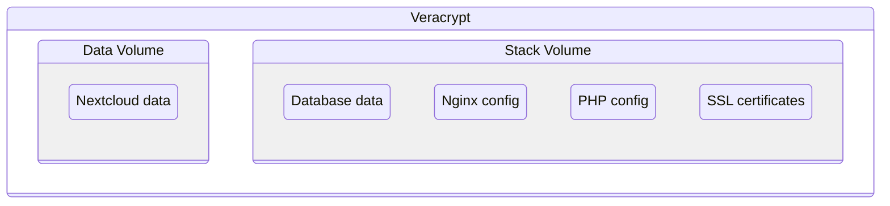

# Setup architecture

Data will be stored in two volumes organized as follow:



## Define variables

Set the variables at the file `.env` as follow:

- `STACK_VERACRYPT_VOLUME_FILE`: Absolute path to Veracrypt volume that will store the stack data
- `DATA_VERACRYPT_VOLUME_FILE`: Absolute path to Veracrypt volume that will store the nextcloud data
- `STACK_VERACRYPT_VOLUME_PASSWORD`: Password to the stack volume
- `DATA_VERACRYPT_VOLUME_PASSWORD`: Password to the data volume
- `STACK_MOUNT_POINT`: Absolute path to where the volume should me mounted at the system
- `DATA_MOUNT_POINT`: Absolute path to where the volume should me mounted at the system
- `STACK_VERACRYPT_SLOT`: Veracrypt slot id to mount the volume
- `DATA_VERACRYPT_SLOT`: Veracrypt slot id to mount the volume
- `SSL_CERTIFICATE_CRT_FILENAME`: Filename of the SSL certificate crt file
- `SSL_CERTIFICATE_KEY_FILENAME`: Filename of the SSL certificate key file

## Create the architecture

Go to the directory `scripts` and run:

```sh
chmod +x *.sh
```

And then:

```sh
./setup-architecture.sh
```
