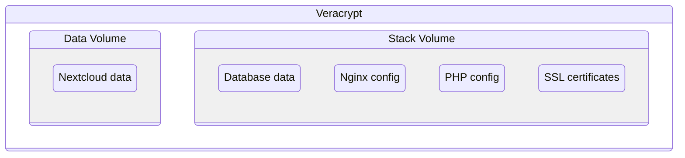

# Setup Veracrypt volumes

Data will be stored in two volumes organized as follow:



## Create mounting devices

```sh
sudo mkdir /media/T8PSN100_nextcloud_stack
sudo mkdir /media/T8PSN100_nextcloud_data
```

## Mount volumes

See the documentation as [how to mount the volumes](manage-veracrypt-volumes.md)

## Create folder structure

```sh
mkdir -p /media/T8PSN100_nextcloud_stack/volumes/database/data
mkdir -p /media/T8PSN100_nextcloud_stack/volumes/nginx
mkdir -p /media/T8PSN100_nextcloud_stack/volumes/php
mkdir -p /media/T8PSN100_nextcloud_stack/volumes/certs
mkdir -p /media/T8PSN100_nextcloud_data/volumes/nextcloud
```

## Unmounting volumes

```sh
sudo veracrypt --text --dismount --slot 10
sudo veracrypt --text --dismount --slot 11
```
